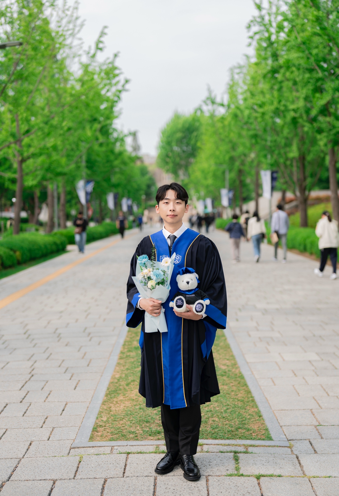

:::: {layout="[30, 70]"}

::: {#first-column}
{width=100% style="border-radius: 10px;"}

 
[<i class="bi bi-file-earmark-pdf"></i> Download CV](cv.pdf){.btn .btn-outline-primary .btn-sm role="button"}
:::

::: {#second-column}
## Sungjun Park

**Graduate Student**  
Department of Mathematics, Yonsei University

Hello! I am **Sungjun Park**, a Graduate Student in Mathematics at **Yonsei University**. My primary research interest lies in **Probability Theory**. I am dedicated to the rigorous study of stochastic processes and their theoretical foundations.
:::

::::

---

## 🎓 Education

**Yonsei University** | Seoul, South Korea  
**M.S./Ph.D. Integrated Student** in Mathematics | *Aug 2025 - Present*  

**Yonsei University** | Seoul, South Korea  
**B.S.** in Mathematics | *Mar 2019 - Aug 2025*

---

## 🔬 Research Interests

* **Probability Theory**: Stochastic Processes, Martingales, Measure Theory

---

## Academinc Tools

* **Languages**: Python, MATLAB
* **Tools**: LaTeX

---

<!-- ## 🏆 Honors & Awards

* **Scholarship Name**, Yonsei University | *2024*
* **Dean's List**, College of Science | *2023* -->